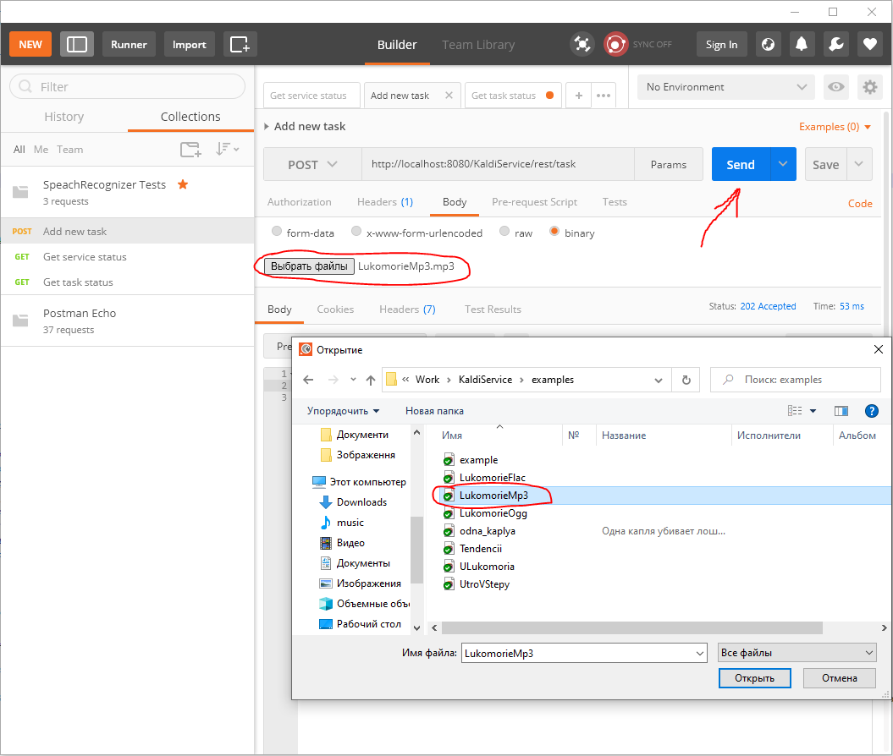
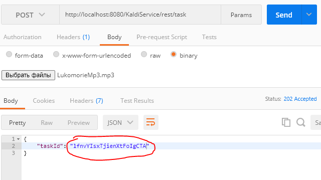

# Kaldi Speech-to-Text REST Service

Service for easy access to speech recognition capabilities of Kaldi using REST interface.
Simple deployment and usage in couple clicks with Docker containers.
Currently supports Russian. 
Models for other languages may be easily added in case of need.

## Deployment and launching

### Preconditions

Install:
* Git 
* Git LFS 
* Docker

### 1. Pull repo

`git clone https://github.com/mvshyvk/KaldiService.git`

### 2. Build Docker container

`cd KaldiService` 
`docker build -t kaldi_service:1.0 ./`

### 3. Launch Docker container

`docker run -it --rm -p 8080:8080 kaldi_service:1.0`

## Project structure

Project files are put to /speech_recognition folder:
* **service/KaldiService** - Java web application that provides REST API to speech recognition capabilities of Kaldi 
* **service/Tests** - Postman REST collection for testing KaldiService API 
* **service/tomcat** - Tomcat default folder where will be put deployed KaldiService web application, it's log and temporary files
* **openapi/KaldiService.yaml** - Open API specification of KaldiService REST API
* **recognition_task.py** - Python script for recognition of a single audio file;
* **/tools** - set of tools for speech recognition:
    * **data_preparator.py** - script for data preparation before speech recognition;
    * **recognizer.py** - script for performing speech recognition;
    * **segmenter.py** - script for speech segmentation;
    * **transcriptins_parser.py** - script for results parsing;
* **/model** - set of files of speech recognition model;
* **/examples** - audio files with examples for testing purpose.

## Speech recognition model

As an acoustic model is used speech recognition model provided by alphacep

http://alphacephei.com/kaldi/kaldi-ru-0.6.tar.gz

For using another acoustic model it should be placed to ./model folder replacing existing files.

> **Attention!** Size of HCLG.fst file is more than 500 Mb so Git LFS must be installed first in order to clone git repo correctly.

## Usage with console client application
### Pull in SpeechRecognitionTest console client application: https://github.com/mvshyvk/SpeechRecognitionTest
`git clone https://github.com/mvshyvk/SpeechRecognitionTest.git`

### Build it

Windows:  
* install vcpkg package manager
* install cpprestsdk library using vcpkg
* open SpeechRecognitionTest folder in Visual Studio 2019
* setup path to CMake toolchain file in CMakeSettings.json (vcpkg/scripts/buildsystems/vcpkg.cmake)
* build project

Linux:
* `cd SpeechRecognitionTest`
* `sudo apt-get install libcpprest-dev`
* `cmake .`
* `make`

### Run application

`./speechRecognitionTest http://localhost:8080 example.mp3`

Example of output:

## Usage with Postman
### Install Postman

### Import [/service/Tests/SpeachRecognizer Tests.postman_collection.json](https://github.com/mvshyvk/KaldiService/blob/master/service/Tests/SpeachRecognizer%20Tests.postman_collection.json) to postman

### Use REST interface for speech recognition

* Use "Add new task" endpoint for submitting audio files

Receive task id

* Use "Get service status" for retrieving service status information

* Use "Get task status" for getting speech recognition results

## OpenAPI specification

https://app.swaggerhub.com/apis-docs/mvshyvk/Kaldi_Speech_Recognition/0.9.0

## Next plans (TODO)

* Implement oauth authentication
* Implement websocket server connection that allows clients to receive notification about task completion without need to poll /task/{taskId}/status endpoint.
* Implement support of multiple language models and possibility to switch between them

